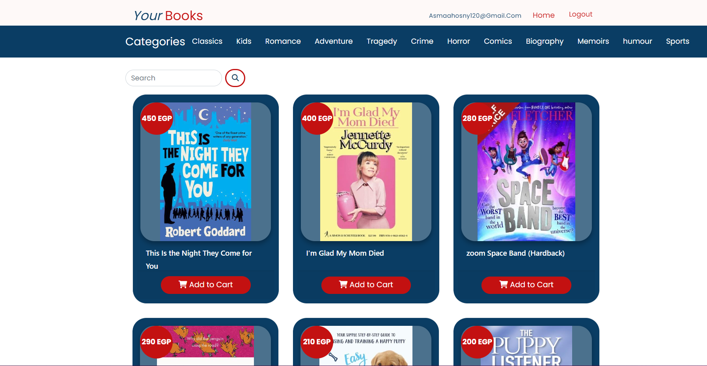
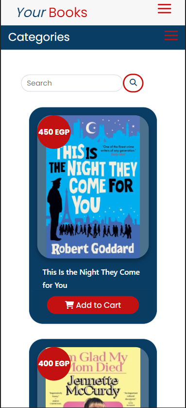

# Project Title
BookStore (my website name is BookY)

# BookY
Full-stack .NET Core Web App.
This e-commerce web application , Administrators have a panel where they can manage everything related to the books. Also, users register on the website and can search for books, monitor the status of their orders, and order the books they like by adding them to their baskets. Ordered books wait to be shipped from the admin panel. The development of the project was done using .NET Core, EntityFramework as an ORM tool, HTML/CSS, JavaScript and jQuery.

# Autorizartion in our Project

## when a user login in the websit

## when an Admin login in the websit

When Admin enters, he is responsible for the process of adding books, managing users and roles, and deleting and modifying the product, so additional buttons appear to him that did not appear to the user.

# Responsive
I made the site compatible with all sizes and I can use it on all devices of different sizes

# Built with
* HTML 5
* CSS 
* Javascript
* Jquery
* .NET Core 3.1
* Entity Framework Core
* Micorsoft SQL Server
* Bootstrap
