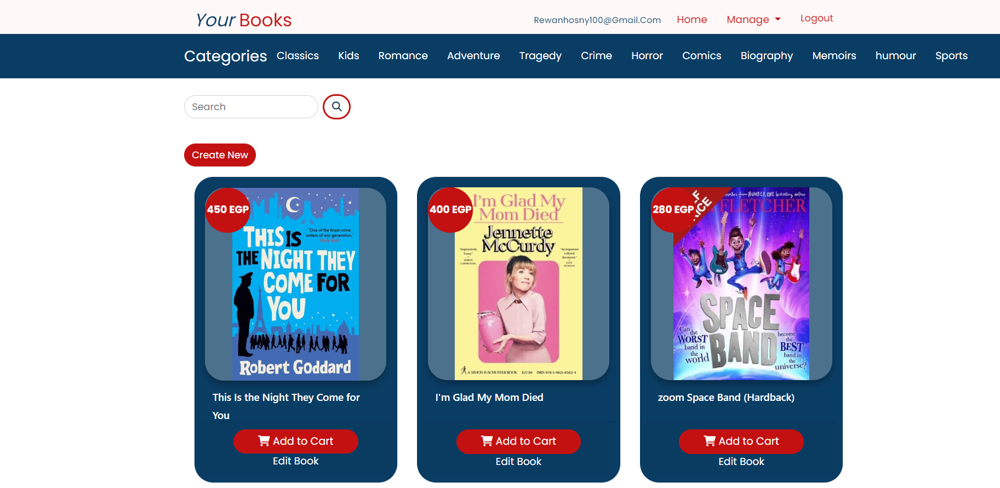

# Project Title
BookStore (my website name is YourBooks)

# BookStore
Bookstore is a demo application for asp.NetCore 
The Bookstore application in this demo is a business service (Bookstore.Service) that implements business features and database.
This e-commerce web application , Administrators have a panel where they can manage everything related to the books. Also, users register on the website and can search for books, monitor the status of their orders, and order the books they like by adding them to their baskets. Ordered books wait to be shipped from the admin panel. The development of the project was done using .NET Core, EntityFramework as an ORM tool, HTML/CSS, JavaScript and jQuery.

